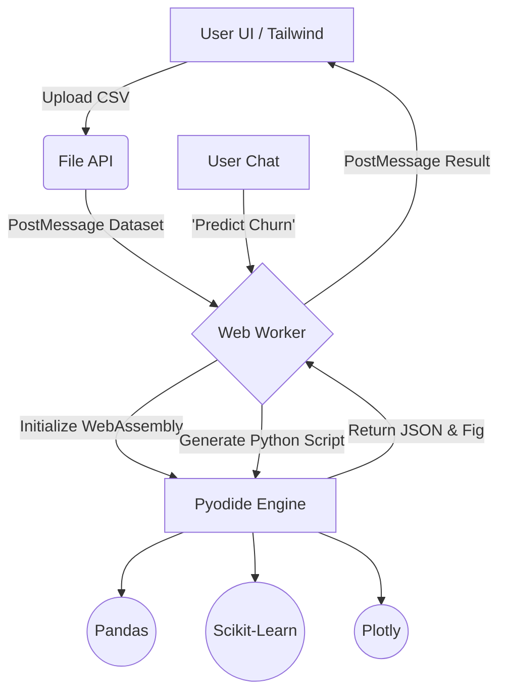

<div align="center">
  
  
  # 🧠 AutoDataSci
  
  **The 100% Serverless, Autonomous AI Data Scientist in your Browser.**
  
  [](https://opensource.org/licenses/MIT)
  [](https://pyodide.org/)
  [](https://tailwindcss.com/)
  [](https://scikit-learn.org/)
  []()
  
  <br>

  *Upload data. Ask a question. Get a trained model and interactive visualizations—instantly, securely, and entirely locally.*

</div>

---

## ⚡ What is AutoDataSci?

**AutoDataSci** is a paradigm-shifting web application that brings a complete Data Science and Machine Learning environment directly to the frontend. By leveraging **WebAssembly (Wasm)**, it runs an autonomous Python data science pipeline—including `pandas` and `scikit-learn`—directly in your browser's memory. 

No backend servers. No cloud APIs. **Absolute data privacy.**

### 🎯 Key Capabilities

| Feature | Description |
| :--- | :--- |
| 📊 **Automated EDA** | Instantly calculates descriptive statistics, finds missing values, and plots correlation matrices. |
| 🛠️ **Smart Preprocessing** | Automatically imputes missing values, scales features, and encodes categorical variables. |
| 🤖 **Agentic ML** | Type "Predict churn" or "Segment my data", and the agent will dynamically write and execute Scikit-Learn pipelines. |
| 📉 **Interactive Charts** | Generates beautiful, responsive visualizations using Plotly.js. |
| 🔒 **Zero Egress** | Your data never leaves your device. Perfect for sensitive, proprietary, or healthcare datasets. |

---

## 🏗️ Architecture & Tech Stack

AutoDataSci achieves backend-level capabilities on the frontend using a modern WebAssembly stack. All heavy lifting is offloaded to Web Workers to ensure a buttery-smooth UI.



### 🧩 Core Technologies

- **[Pyodide](https://pyodide.org/)**: Compiles the CPython interpreter to WebAssembly, allowing native Python libraries to run at near-native speeds in the browser.
- **[Scikit-Learn & Pandas](https://scikit-learn.org/)**: The gold standard for data manipulation and classical machine learning.
- **[Plotly.js](https://plotly.com/javascript/)**: Powers the high-performance, interactive visualizations.
- **[Tailwind CSS](https://tailwindcss.com/)**: Provides the responsive, dark-mode-first aesthetic.

---

## 🚀 Getting Started

Since AutoDataSci is completely serverless, deploying and running it is incredibly simple.

### Local Development

1. **Clone the repository:**
   ```bash
   git clone https://github.com/your-username/AutoDataSci.git
   cd AutoDataSci
   ```
2. **Serve the directory:**
   Using Python:
   ```bash
   python -m http.server 8000
   ```
   Or using Node.js:
   ```bash
   npx serve .
   ```
3. **Open your browser:** Navigate to `http://localhost:8000`

### 🌐 Deploying to GitHub Pages (1-Click)

AutoDataSci is perfectly suited for static hosting on GitHub Pages:

1. Push this repository to your GitHub account.
2. Go to **Settings** > **Pages**.
3. Under **Build and deployment**, set the source to **Deploy from a branch**.
4. Select your `main` branch and the `/ (root)` folder, then click **Save**.
5. Wait ~1 minute, and your site will be live!

---

## 📸 Preview

<div align="center">
  
  <br>
  <i>A beautiful, responsive UI that feels like a native application. (Illustrative)</i>
</div>

---

## 💡 How the AI Works

Instead of relying on heavy, slow, or expensive API-based LLMs (like OpenAI) or requiring you to download a 4GB+ local LLM, AutoDataSci uses a **Heuristic Natural Language Router** running in Python. 

When you ask a question:
1. The text is parsed by the Pyodide engine.
2. Intent extraction maps the request to a specific analytical pipeline (e.g., Classification, Regression, Clustering).
3. The dataset is dynamically prepared (One-Hot Encoding, Label Encoding, Imputation).
4. The model is trained dynamically based on the identified target variable.

---

## 📄 License

This project is licensed under the MIT License - see the [LICENSE](LICENSE) file for details.

<div align="center">
  <b>Built with ❤️ for a future of decentralized, private AI.</b>
</div>
